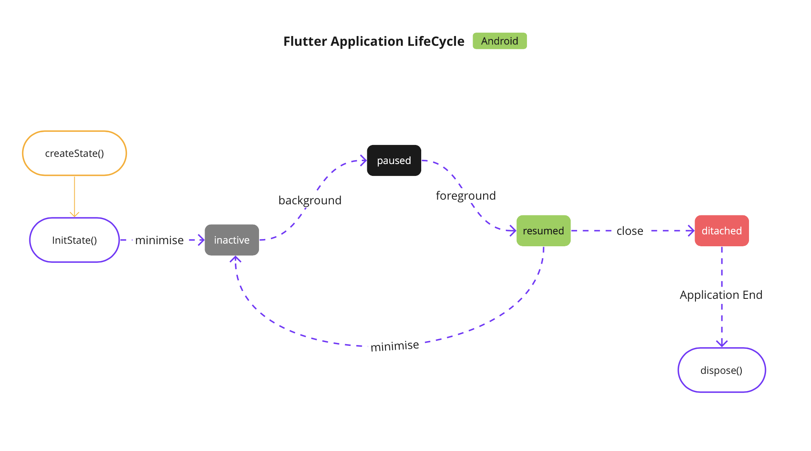
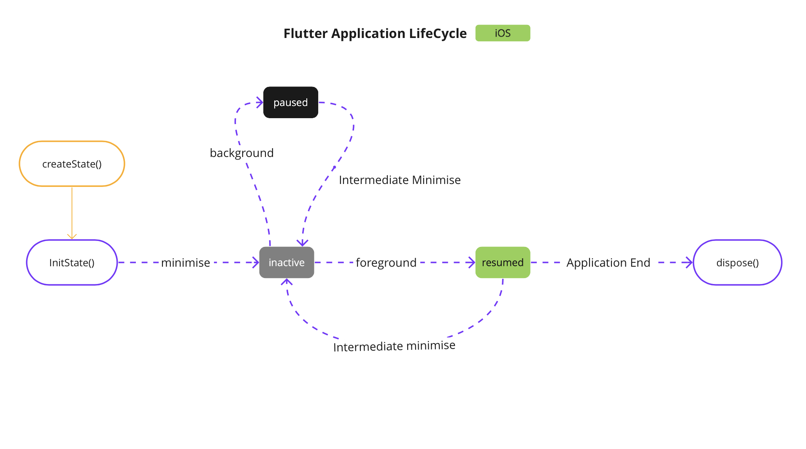
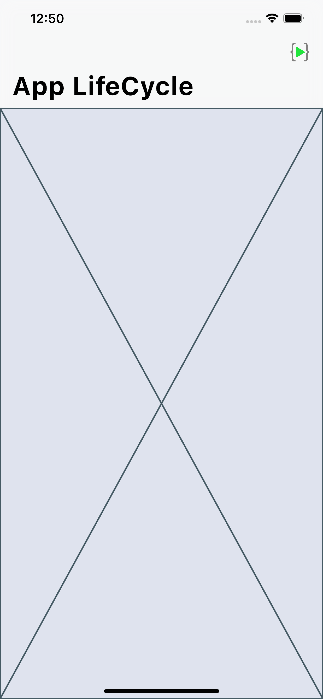
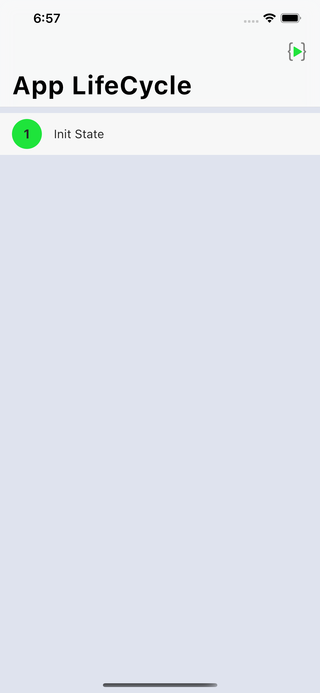
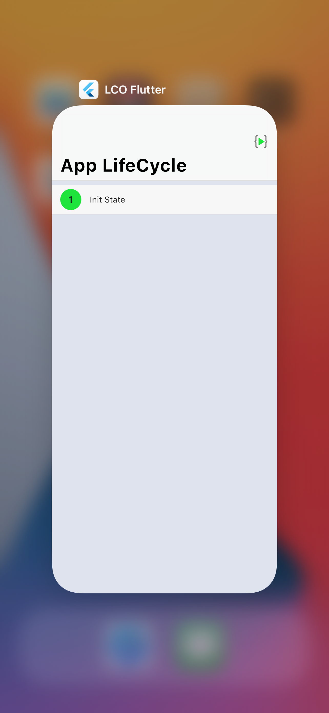
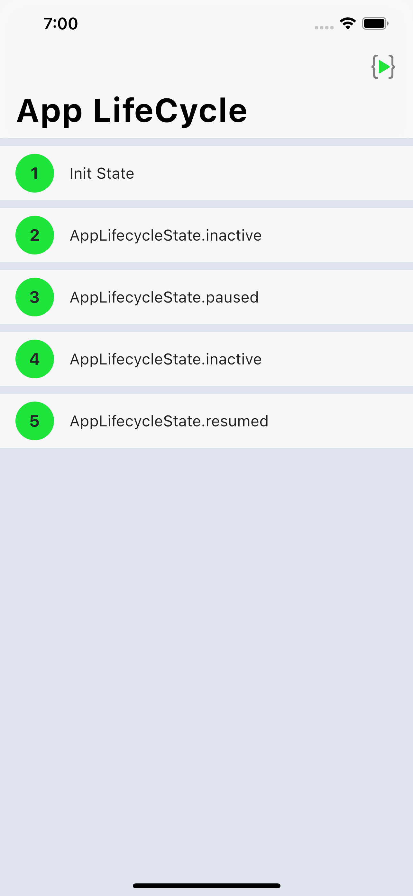
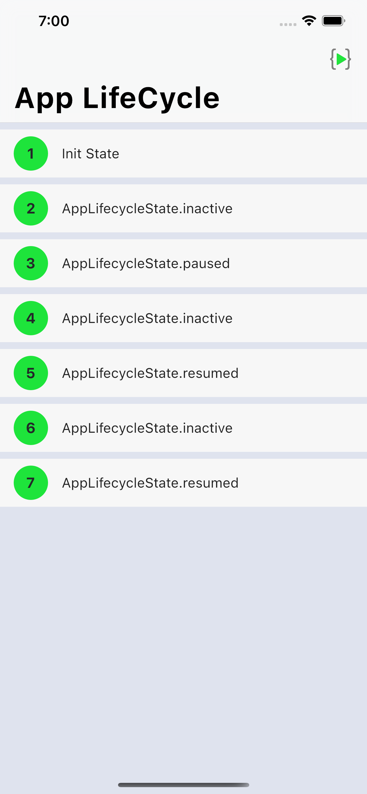
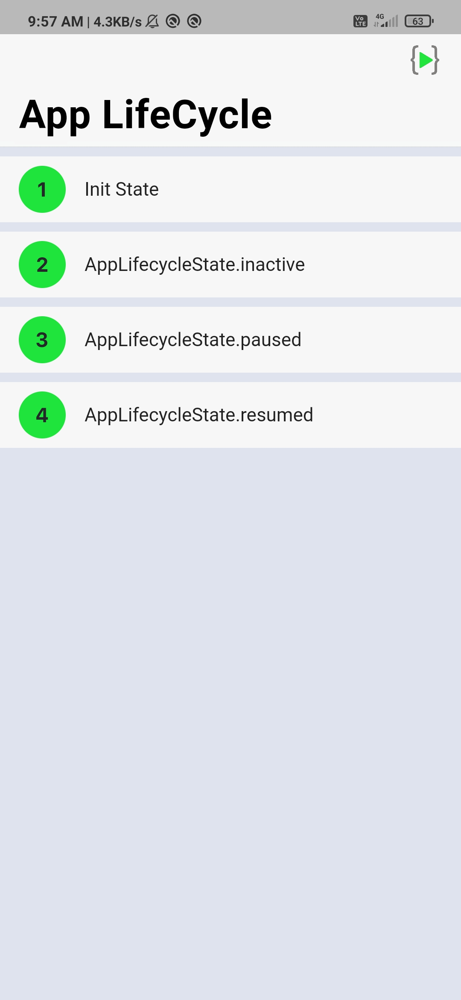
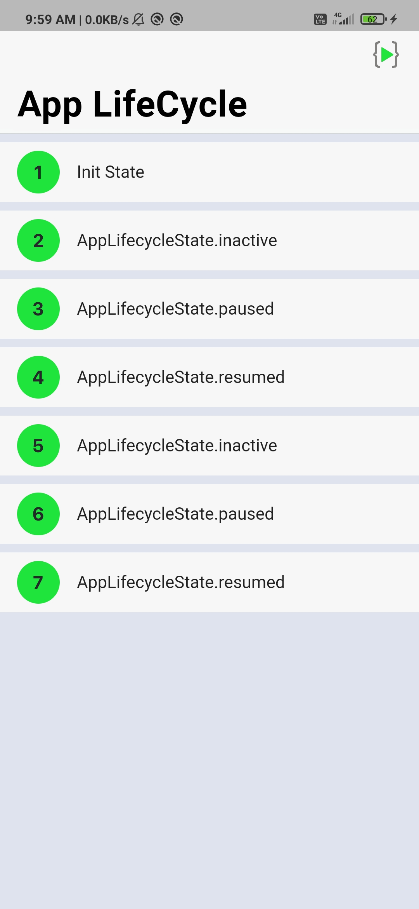

# Flutter LifeCycle

Have you ever thought of Why is your Flutter Application gets crashed/restart(when your app is in background for a while) or you want to improve performance  i.e, stop/start services when app is in background/foreground repectively.

Then you should know, how to handle Flutter Application LifeCycle. For LifeCycle, you need to use  WidgetsBindingObserver  it works when the app goes on foreground and background.

## WidgetsBindingObserver

WidgetsBindingObserver should be used to get default behaviors for all of the handlers. In our case, when we want to listen to the AppLifecycleState and call stop/start on our services.

So, We need to add WidgetsBindingObserver to our Stateful Widget. These are most familiar methods we use here are:


initState() :it is the first method called after the Widget is created.This is our equivalent to onCreate() and viewDidLoad()

dispose() :is called when this object and its State is removed from the tree permanently and will never build again.

Oh!, We actually forgot to talk about AppLifecycleState

## AppLifecycleState 

Simply The States that an application can be in

- `inactive` - The application is in an inactive state and is not receiving user input.

- `paused` - The application is not currently visible to the user, not responding to user input, and running in the background.

- `resumed`- The application is visible and responding to user input.

- `detached` -The application is still hosted on a flutter engine but is detached from any host views. (Android 10 & above only)

Although, Flutter behaves identical in both Android and iOS but there is an actual difference when it comes to AppLifeCycleState's

### Flow Chart of AppLifecycleState

**Android**
<p align="center">

</a>
</p>

**iOS**
<p align="center">

</a>
</p>

Lets breakdown the theory, now we will create a simple app which displays the LifeCycle Prossess in a form of a List.

### Getting Started

This article uses Visual Studio, but Android Studio Code will work fine as well.

Created a Stateful Widget named as `LifeCycle` and its state with `WidgetsBindingObserver` 

```dart
import 'package:flutter/cupertino.dart';
import 'package:flutter/material.dart';


class LifeCycle extends StatefulWidget {
  @override
  _LifeCycleState createState() {
    return _LifeCycleState();
  }
}

class _LifeCycleState extends State<LifeCycle> with WidgetsBindingObserver {

  @override
  Widget build(BuildContext context) {
    return Material(
      child: CupertinoPageScaffold(
        backgroundColor: kBackgroundcolor,
        child: NestedScrollView(
          headerSliverBuilder: (BuildContext context, bool innerBoxIsScrolled) {
            return <Widget>[
              CupertinoSliverNavigationBar(
                largeTitle: Text("App LifeCycle"),
                trailing: logo()
              )
            ];
          },
          body: Placeholder()
        ),
      ),
    );
  }
}

```

<p align="top">
<p>Here’s how the app will look when you’re done:</p>
</a>

</a>
<figcaption>Starter Project<figcaption>

</a>

</a>

</a>

</a>

</a>

</a>

</a>
</p>

```dart

```
